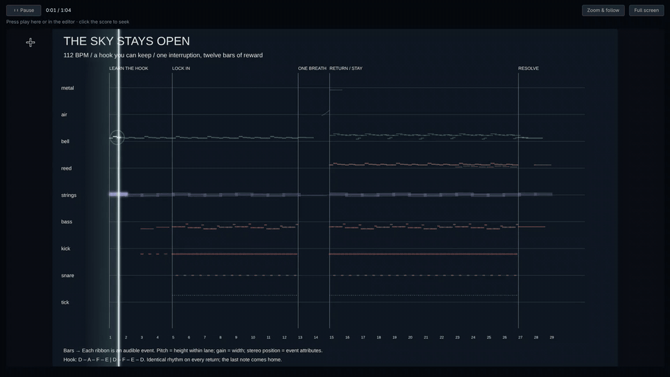
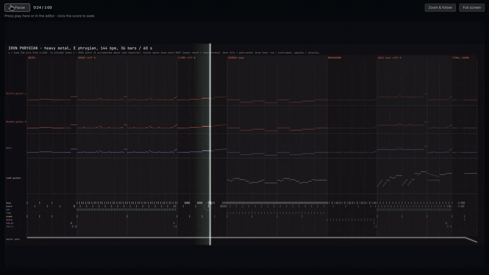
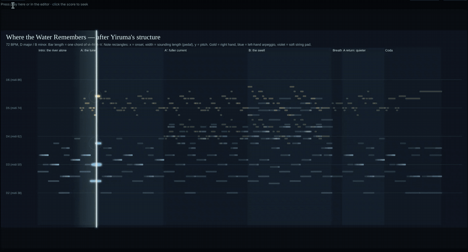

# Procedural Sound Studio

**Describe a sound. An LLM writes an executable SVG score and the Python synth that plays it. You get a WAV, and a score that moves while it plays.**

<p align="center"><br><sub><b>The Sky Stays Open</b> · <a href="https://github.com/areu01or00/procedural-sound-studio/releases/download/v1.0.0/sky-stays-open-demo.mp4">▶ watch with sound (47 s)</a></sub></p>

<p align="center"><br><sub><b>Iron Phrygian</b> · <a href="https://github.com/areu01or00/procedural-sound-studio/releases/download/v1.0.0/iron-phrygian-demo.mp4">▶ watch with sound (56 s)</a></sub></p>

<p align="center"><br><sub><b>Where the Water Remembers</b> · <a href="https://github.com/areu01or00/procedural-sound-studio/releases/download/v1.0.0/where-the-water-remembers-demo.mp4">▶ watch with sound (2 min)</a></sub></p>

<p align="center"><sub>Music in Studio so far has been composed by <b>DeepSeek v4.1 Flash</b>, <b>GPT-6-Astra</b> and <b>Claude Opus 5.5</b>. Every note, instrument and synthesis routine is written by the model; the videos are screen recordings of the app, only trimmed.</sub></p>

LLMs can't output audio, so this app has them *write* it instead. Every note is a visible shape in an SVG file: its position is time, its height is pitch, its attributes are loudness, pan and timbre. A paired `render.py` reads that SVG and synthesizes the sound, using the model's own synthesis or recorded General MIDI instruments. Edit a shape, re-render, and the music changes.

It's a desktop app (Electron) built around the [AudioMass](https://github.com/pkalogiros/AudioMass) web audio editor, driven by coding agents you already have: **Codex**, **Claude Code**, or any model on **OpenRouter**.

> **Linux only for now.** macOS and Windows aren't supported yet.

## What you get per request

Each version is saved in its own folder:

| File | What it is |
|---|---|
| `score.svg` | The executable score: every sound-producing mark carries `data-audible="true"` |
| `render.py` | The model-written renderer; it reads only the saved score |
| `audio.wav` | The result, loaded straight into the AudioMass editor |
| `notes.md` | What the model tried and how to edit it |

Keep talking to revise: every follow-up creates a new version and keeps the old ones.

## Features

- **Live score stage:** the SVG is animated in sync with playback. Sounding notes glow, onsets ripple, click to seek, zoom-and-follow, full screen.
- **Recorded instruments:** `resources/instruments/gm.py` gives renderers 128 General MIDI instruments through FluidSynth, so piano, strings, brass and guitars sound real. The model can still build its own synthesis for anything else.
- **Provenance check:** after each turn Studio removes every audible mark, re-runs the renderer in a sandbox, and expects silence. That proves the sound really comes from the score. It also checks files, audio and SVG structure, and gives the model one automatic repair pass if something is wrong.
- **Settings:** provider and model, reasoning effort, web research on/off (off removes the search tools), and auto-approve for unattended runs.

## Requirements

- **Node.js 22+**
- **Python 3.10+** with `numpy scipy soundfile pillow matplotlib` (see `requirements.txt`)
- **FFmpeg** (`ffprobe` is used to validate outputs)
- **FluidSynth** plus the **FluidR3_GM** soundfont, for recorded instruments
- **bubblewrap** (`bwrap`) for the sandboxed provenance check. Without it the check is skipped with a warning; generated code is never run unsandboxed.
- At least one provider, using **your own** login or key (see below)

Install the system packages:

```sh
# Arch / Omarchy
sudo pacman -S nodejs npm python ffmpeg fluidsynth soundfont-fluid bubblewrap
# Debian / Ubuntu
sudo apt install nodejs npm python3-venv ffmpeg fluidsynth fluid-soundfont-gm bubblewrap
```

## Install and run

```sh
git clone <this repo> && cd <repo>
npm install
python3 -m venv .venv && .venv/bin/pip install -r requirements.txt
npm start
```

Browser mode instead of Electron: `npm run dev`, then open http://127.0.0.1:5055.

## Providers: use your own accounts

Studio never asks for, stores or forwards your provider credentials. It drives the tools you already have installed, and usage is billed to **your** account.

- **Codex:** install the [Codex CLI](https://github.com/openai/codex) and run `codex login`. Studio talks to it through `codex app-server`.
- **Claude:** install [Claude Code](https://code.claude.com) and sign in with your own Claude account, by running `claude` once. Studio runs your local Claude Code through the Claude Agent SDK.
- **OpenRouter:** paste your OpenRouter API key in Settings. It's held in memory only, and runs any OpenRouter model through Codex's harness.

Pick the provider, model and reasoning effort from the gear icon.

## Configuration

| Variable | Purpose |
|---|---|
| `STUDIO_PYTHON` | Python interpreter (default: `.venv/bin/python`, then `python3`) |
| `STUDIO_SOUNDFONT` | Path to a General MIDI `.sf2` (default: common FluidR3_GM locations) |
| `CODEX_BIN` / `CLAUDE_BIN` | Custom Codex / Claude Code executables |
| `OPENROUTER_API_KEY` | Preload your OpenRouter key |
| `PORT` | Port for `npm run dev` (default 5055) |

Generated work lives in `.studio/` (git-ignored). Back it up if you care about it.

## Tests

```sh
npm test                                   # unit and integration tests, no model calls
./node_modules/.bin/electron test/stage-ui.cjs   # live score stage in a real window
```

## Honest limits

- Quality varies by model, reasoning effort and request. The best results so far are from iterating: say what's missing and let it revise.
- Models can't hear. Checks prove the score drives the sound, not that the music is good. You're the judge.
- Sung vocals and editing individual parts of an existing recording are not supported well.

## Credits and license

- [AudioMass](https://github.com/pkalogiros/AudioMass) by Pantelis Kalogiros (MIT), the audio editor this app is built on. Its original README is in `docs/AUDIOMASS-README.md`.
- [FluidSynth](https://www.fluidsynth.org/) and the FluidR3_GM soundfont, installed separately.
- Bundled third-party libraries keep their own licenses: see `THIRD_PARTY_NOTICES.md`.

Studio's own code is MIT licensed; see `LICENSE`.
